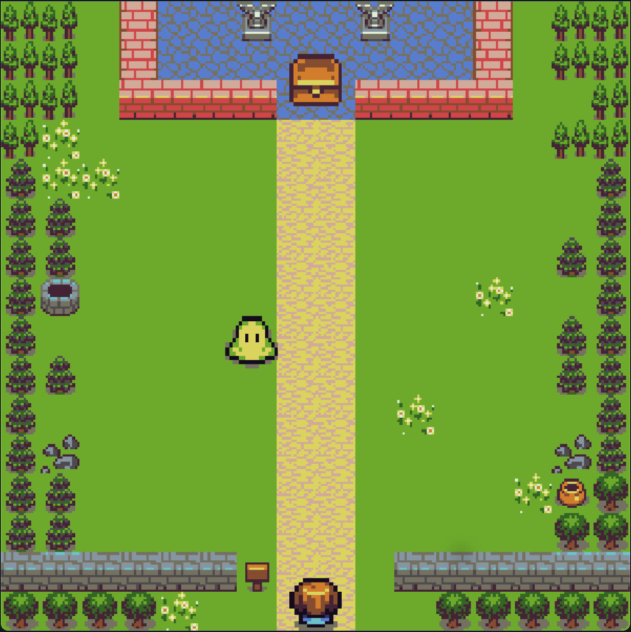

# Crossing-Game
A simple "crossy" style game (similar to games like "Frogger") made using the PyGame library.  
  

  

  

- Run main.py to play.  
- Move your character using the up and down arrow keys.  
- Successfully reaching the treasure will raise the difficulty, by increasing both the number of enemies and their movement speed.  
- Touching an enemy will reset progress back to the lowest difficulty.  

------------------------
  
This was primarily made as a small project for my own practice - and as such, I likely won't be expanding it further.  
